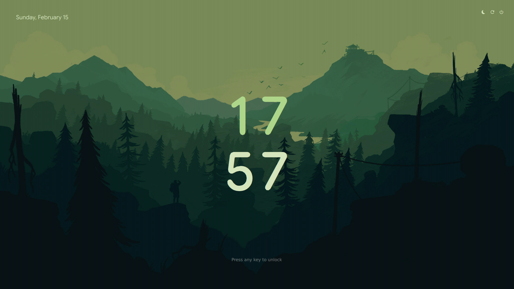
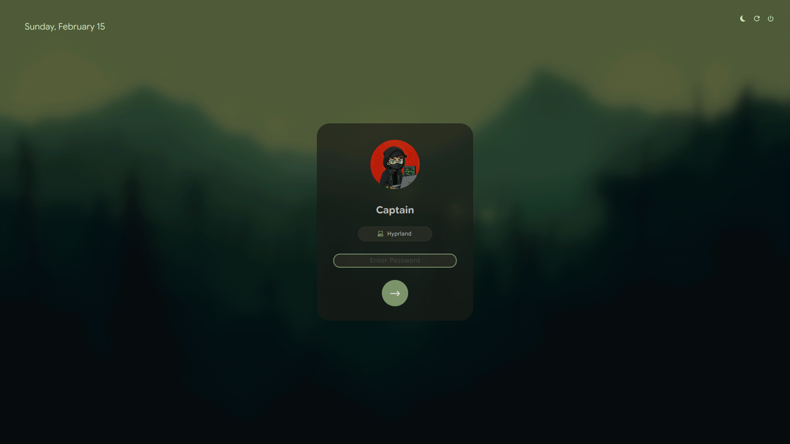
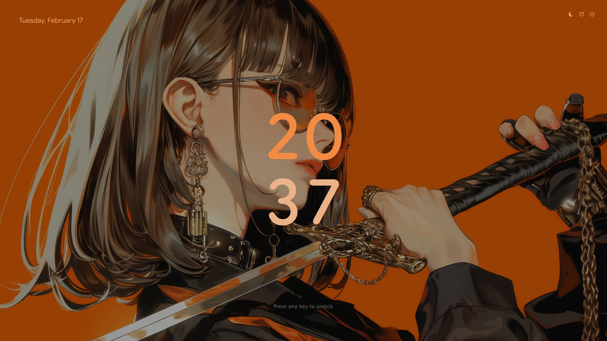
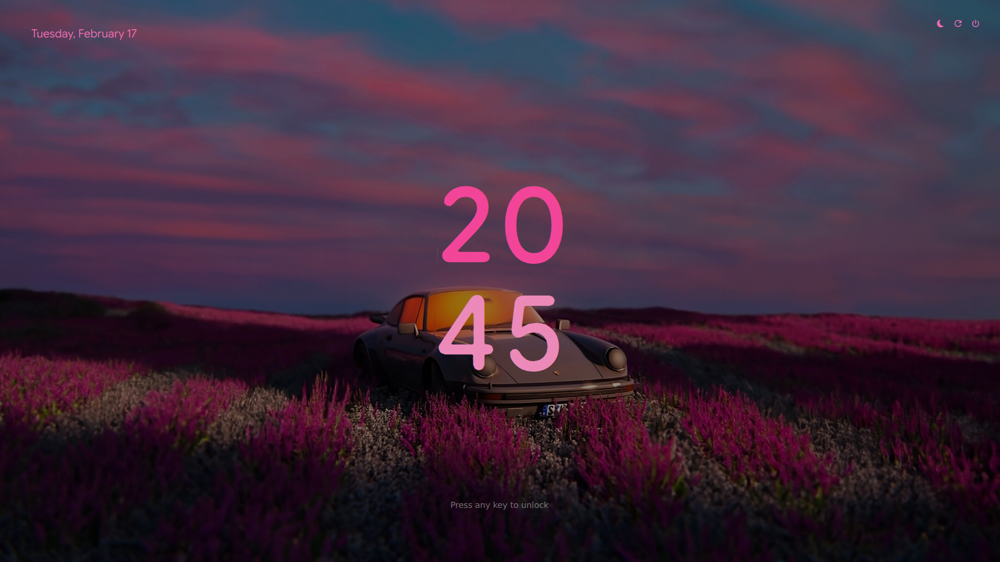
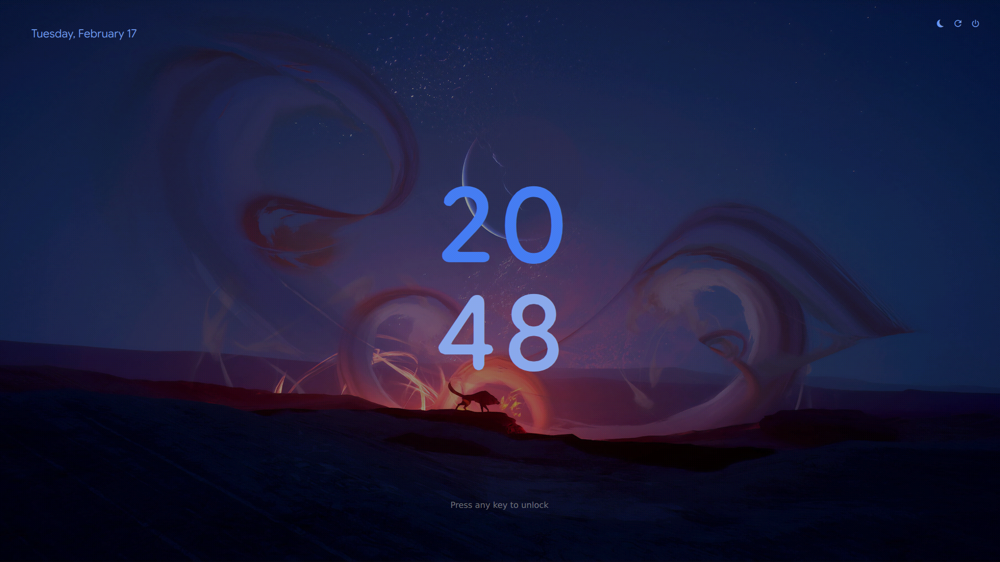
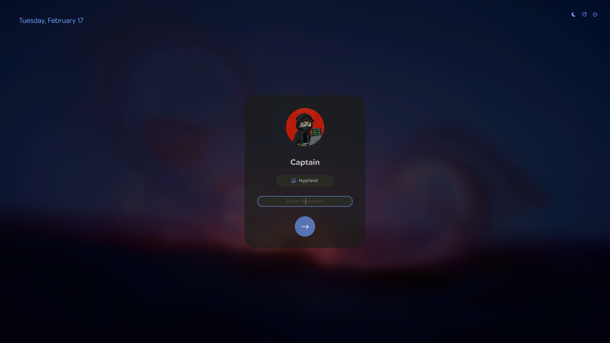

# ✨ Pixie SDDM

A clean, modern, and minimal SDDM theme inspired by Google Pixel UI and Material Design 3. 

<div align="center">
  
  
</div>

<div align="center">
  
  
  
  
</div>

<div align="center">
  
  
  
  
</div>

## 🌟 Features

- **Pixel Aesthetic:** Clean typography and a unique two-tone stacked clock.
- **Material You Dynamic Colors (v2.0):** Intelligent color extraction logic that automatically samples your wallpaper to create a perfectly matched dual-tone clock and UI accents.
- **Smooth Transitions:** High-performance fade-in animations for the clock and UI elements once color extraction is complete.
- **Material Design 3:** Dark card UI with "Material You" inspired accents and smooth interactions.
- **Interactive Dropdowns:** Sophisticated user and session selection menus with perfect vertical alignment.
- **Keyboard Navigation:** Full support for navigating menus with `Up`/`Down` arrows and confirming with `Enter`.
- **Intelligent Fallbacks:** 
  - Shows a beautiful "Initial" circle (e.g., "C" for Captain) if no user avatar is found.
  - Automatically handles session names and icons for a polished look.
- **Blur Effects:** Adaptive background blur that transitions smoothly when the login card is active.

## 🚀 Installation

The easiest way to install **Pixie** is by using the provided interactive installation script:

**(Recommended)**
```bash
git clone https://github.com/xCaptaiN09/pixie-sddm.git && cd pixie-sddm && sudo ./install.sh
```

The script will copy the files and offer to automatically set Pixie as your active theme.

### Manual Installation (Alternative)

1. **Clone and enter the repository:**
   ```bash
   git clone https://github.com/xCaptaiN09/pixie-sddm.git && cd pixie-sddm
   ```

2. **Copy the theme to SDDM directory:**
   ```bash
   sudo mkdir -p /usr/share/sddm/themes/pixie
   sudo cp -r * /usr/share/sddm/themes/pixie/
   ```

### 3. Test the theme (Optional)
You can test the theme without logging out using the `sddm-greeter`:
```bash
sddm-greeter --test-mode --theme /usr/share/sddm/themes/pixie
```

## 🛠 Configuration

If you didn't use the automatic installer, you can set **Pixie** as your active theme by editing your SDDM configuration file (usually `/etc/sddm.conf` or a file in `/etc/sddm.conf.d/`):

```ini
[Theme]
Current=pixie
```

## 🎨 Customization

You can easily customize the theme by editing the `theme.conf` file inside the theme directory:

- **Background:** Replace `assets/background.jpg` with your own wallpaper. The theme will automatically adapt its colors!
- **Accent Fallback:** The `accentColor` setting now acts as a smart fallback if the automatic extraction needs a manual hint.
- **Fonts:** The theme uses `Google Sans Flex` (included).

## 📦 Requirements

- **SDDM**
- **Qt 5** (Specifically `QtQuick Controls 2`, `Layouts`, and `GraphicalEffects`)
- **Nerd Fonts** (for power icons)

## 🤝 Credits

- **Author:** [xCaptaiN09](https://github.com/xCaptaiN09)
- **Design Inspiration:** Google Pixel & Material You.
- **Font:** Google Sans Flex.

---
*Made with ❤️ for the Linux community.*
